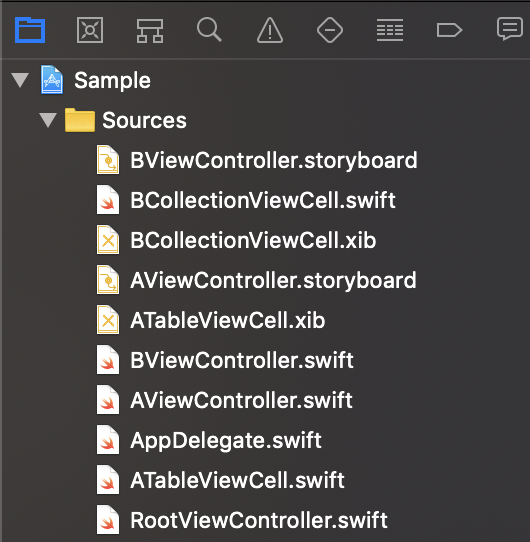
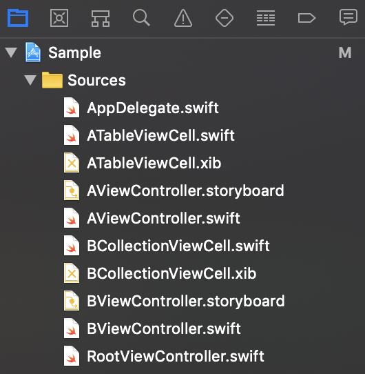
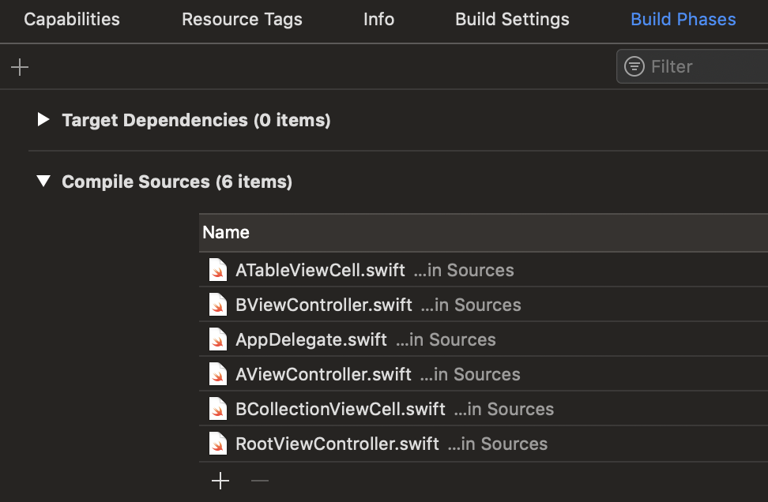
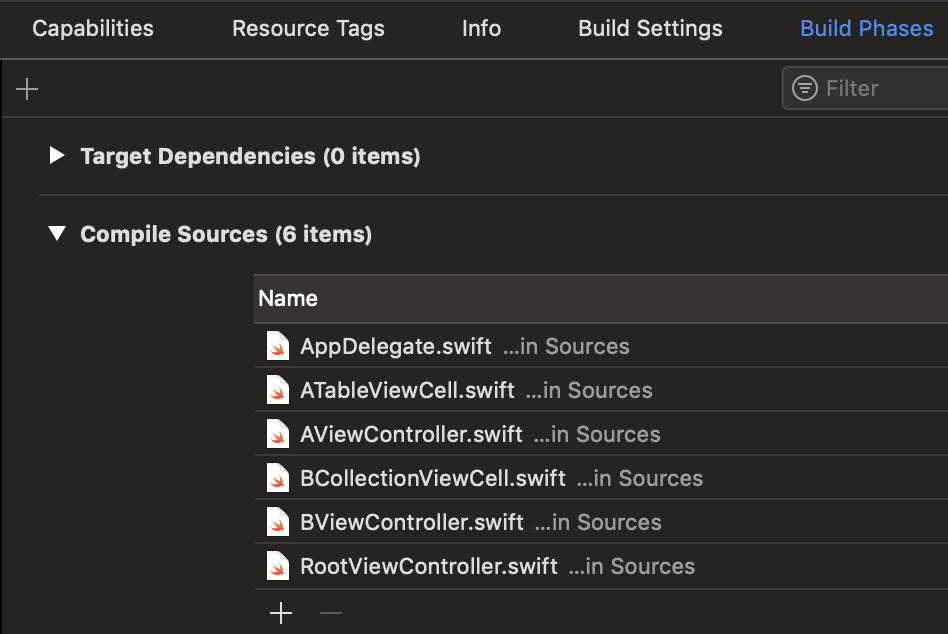

# SortPbxproj


[](https://doge.mit-license.org)
[](https://developer.apple.com/swift)

`SortPbxproj` is a command-line tool that sort "children" and "files" sections in Xcode project.pbxproj files as shown in the screenshots below. This script is inspired on by [sort-Xcode-project-file](https://github.com/WebKit/webkit/blob/master/Tools/Scripts/sort-Xcode-project-file).

|before|after|
|:---|:---|
|||
|||

## Installation

### Homebrew (Recommended)

```sh
$ brew install WorldDownTown/taps/sort-pbxproj
```

or

```sh
$ brew tap WorldDownTown/taps
$ brew install sort-pbxproj
```

### From Source

Clone the master branch of the repository, then run `make install`.

```sh
$ git clone https://github.com/WorldDownTown/SortPbxproj.git
$ make install
```

## Usage

```sh
$ sort-pbxproj <path>

ex 1)
$ sort-pbxproj SampleApp.xcodeproj

ex 2)
$ sort-pbxproj SampleApp.xcodeproj/project.pbxproj
```

### Arguments

#### `path`

File path to `*.xcodeproj` or `project.pbxproj`.

### Options

You can see options by `sort-pbxproj --help`.

#### --no-warnings

- Default: false
- `sort-pbxproj` checks the filename, and an error occurs if it is not `project.pbxproj`. By adding `--no-warnings` flag, script ignores the filename.
